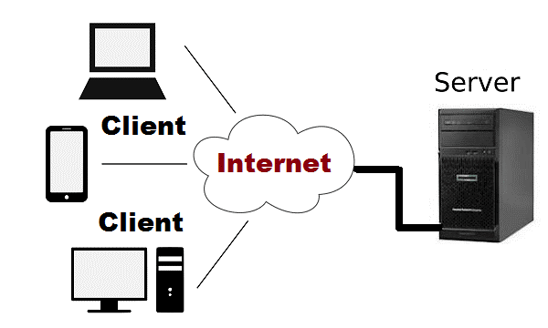

# My Experience of Web Apps

Dr Steve Huckle

s.huckle@susex.ac.uk

March 2023

- - -

# Lecture Overview

+ The 101 of WebApps
+ Some WebApps I've Built
+ Q & A

- - -

# Goals

At the end of this lecture, I hope that you will have a better understanding of the Web Applications space and be so excited, you'll want a career in Web Development!

- - -

# Web Development

Web Development is the best job in the world:

1. Your platform of choice has nearly 5 billion daily active users!
2. It's a platform that behaves like a super-intelligent brain:
    1. It can cure diseases
    2. Eliminate poverty
    3. Advance science

- - -

# Wep Development (cont'd)


- - -

# Web Development 101

To take advantage of that super-intelligent brain, you're going to want to know about that brain.

- - -

# Web Development Topics

+ Internet
+ Internet protocols
+ IP Addresses
+ TCP
+ Web Protocol

- - -

# Internet

The Internet is a network of billions (trillions?) of machines connected together, fist establised in the early 1980s. You can think of it as the hardware underlying all the software built on top of it.

- - -

# Protocol Suite


# Internet Protocol 

Network IP is used to identify machines on the Internet by assigning them a unique IP address, e.g.

168.172.25.1

# TCP


- - -

# Packets

Data is sent as a collection of small packets across the data link, and resequenced by the receiving device.

- - -

# World Wide Web

It's like some software that sits on top of the hardware (the Internet).

- - -

# Http

The Hypertext Transfer Protocol (Http) allows people to access web applications.

- - -

# Http Methods

+ GET
+ POST
+ PUT
+ PATCH
+ DELETE

- - -

# DNS

Every website has a unique domain name that maps to a specific IP Address via DNS:

Name: www.google.com
Address: 142.250.178.4

- - -

# Registar


- - -

# URL

Http gives resources on the web a uniform resource locator (URL) - some unique address under each domain:

www.google.com/gmail

- - -

# Client Server



- - -

# Browser 

Browsers allow us to access the web by rendering content from the URLs.

- - -

# HTML

The content rendered by a browser is represented by Hypertext Markup Language (HTML)

# Dev Tools


- - -

# Semantic HTML Elements 

```html
<!DOCTYPE html>
<html lang="en">
    <head>
        <meta charset="UTF-8">
        <meta http-equiv="X-UA-Compatible" content="IE=edge">
        <meta name="viewport" content="width=device-width, initial-scale=1.0">
        <link rel="stylesheet" href="style.css">
        <script defer src="index.js"></script>
        <title>Web Development</title>
    </head>
    <body>
        <main>
            <article>
                <h1>Web Development ROX</h1>
                <p>...you can reach 5 billion people - huzzah!</p>
            </article>
        </main>
    </body>
</html>
  ```

- - -

# Anchors

```html
<a href="http://example.com">example.com</a>
```

# DOM


- - -

# CSS

```css
p {
  margin-bottom: 1rem;
  line-height: 1.3rem;
  color: #0000cc;
}
```

- - -

# Layout and Positioning

(CSS is tricky - it takes time, practice and patience)


- - -

# Responsive Layouts

CSS provides tools for making your web apps look good across the range of devices upon which they might be viewed.

```css
@media only screen and (min-width: 600px) {

    p {
        margin-bottom: 0.5rem;
        line-height: 1rem;
        color: #00cccc;
      }

}
```

- - -

# Responsive Layouts (cont'd)

Grids and flexboxes

```css
.grid-container {
    max-width: 600px;
    padding: 8px;

    display: grid;
    grid-template-columns: repeat(auto-fit, minmax(150px, 1fr));
    grid-auto-rows: minmax(200px, auto);
    gap: 8px;

    border: 2px dotted lightcoral;
}
```

- - -

# Javascript

Adds programmability and user interaction to the content.

```js
<script>
    const hello = "Hello World!";
    alert(hello);
</script>
```

- - -

# Events


- - -

# Events Listeners

```js
const button = document.querySelector('#submitButton')
button.onClick = () => {
    alert('submitted')
}
```

- - -

# ECMAScript

Javascrpt is standardised across all major browsers.

- - -

# Typsecript 

Javascript is dynamically typed. Typescript is a language that is a superset of Javascript because it includes javascript as well as added syntax for types.

```typescript
let hello: string = `hello ${name}`;
```

- - -

# Frontend Frameworks


- - -

# Component-based

```js
<About />
```

- - -

# Node Package Manager


- - -

# Export

```js
export const fetchData = async (props) => {
    const { url, options, cb } = props
    
    try {

        const response = options ? await fetch(url, options) : await fetch(url)
        const data = await response.json()
        if (cb) cb(data)

    } catch (error) {
        console.error('fetchData', error)
    }
}
```

# Import

```js
import { fetchData } from "./utils";
...
const fetchParams = {
    url: process.env.REACT_APP_DBASE + ":" +  process.env.REACT_APP_DBASE_PORT + Remote.website,
    cb: fetchCallback
}
fetchData(fetchParams)
```

- - -

# Single-page Applications (SPA)


- - -

# Web Servers


- - -

# Backend (Server) Systems


- - -

# Node.js


- - -

# Express


- - -

# Content Management Systems


- - -

# Object Resource Managers


- - -

# Databases


- - -

# Server-side Rendering


- - -

# Data Exchange

```json
{
  "squadName": "Super hero squad",
  "homeTown": "Metro City",
  "formed": 2016,
  "secretBase": "Super tower",
  "active": true,
  "members": [
    {
      "name": "Molecule Man",
      "age": 29,
      "secretIdentity": "Dan Jukes",
      "powers": ["Radiation resistance", "Turning tiny", "Radiation blast"]
    },
    {
      "name": "Madame Uppercut",
      "age": 39,
      "secretIdentity": "Jane Wilson",
      "powers": [
        "Million tonne punch",
        "Damage resistance",
        "Superhuman reflexes"
      ]
    },
    {
      "name": "Eternal Flame",
      "age": 1000000,
      "secretIdentity": "Unknown",
      "powers": [
        "Immortality",
        "Heat Immunity",
        "Inferno",
        "Teleportation",
        "Interdimensional travel"
      ]
    }
  ]
}
```


